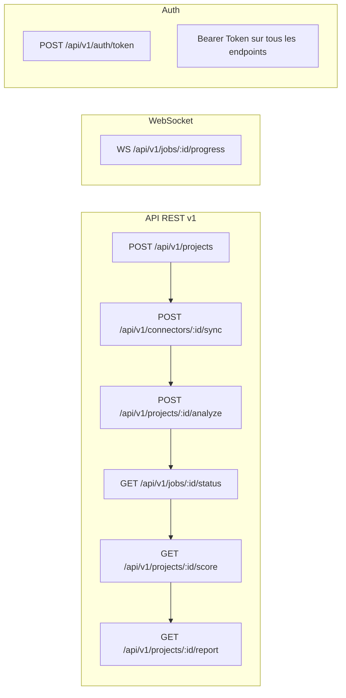
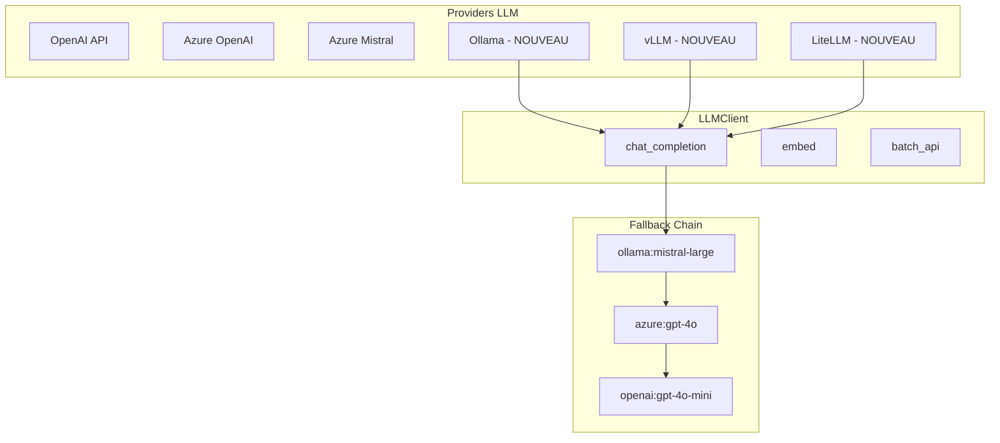
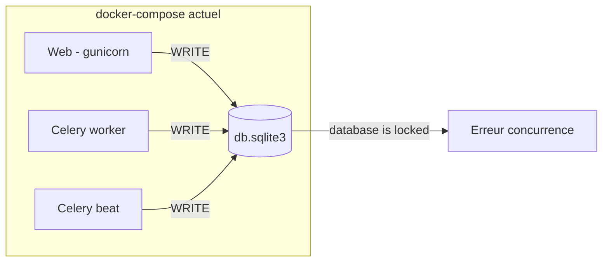
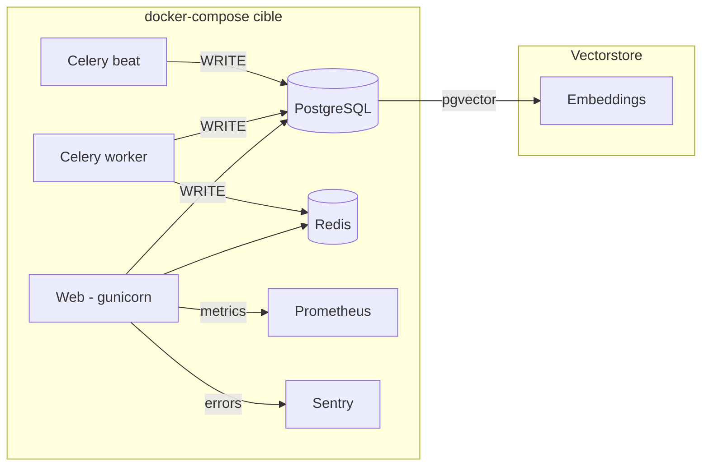
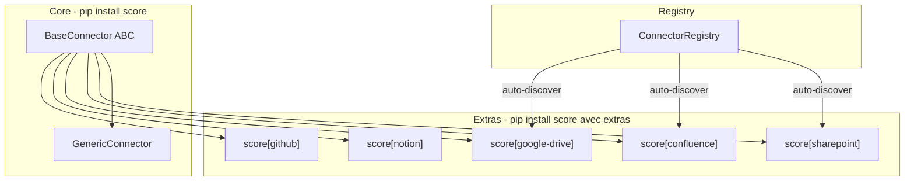
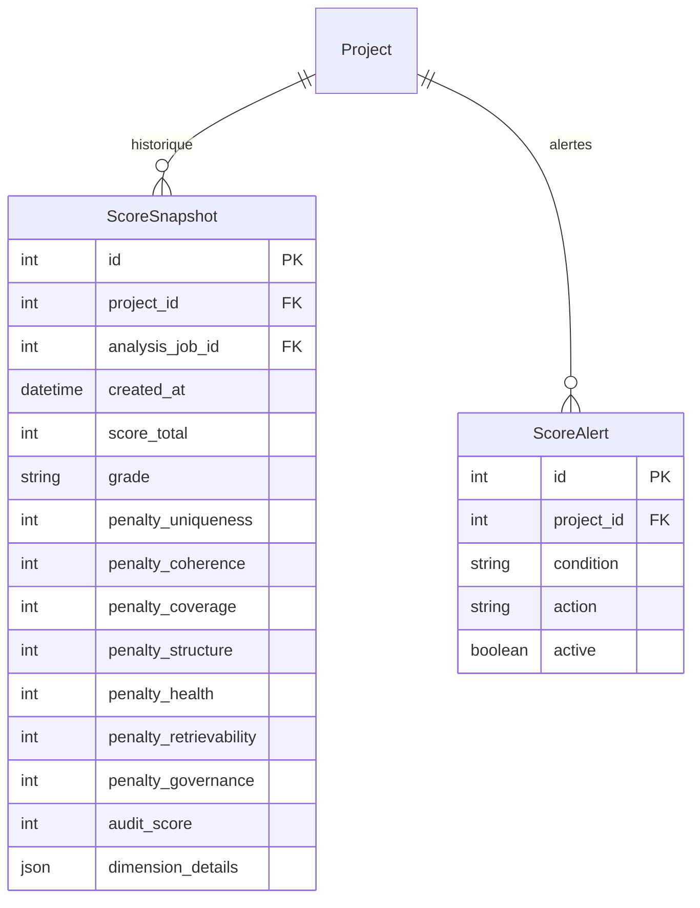
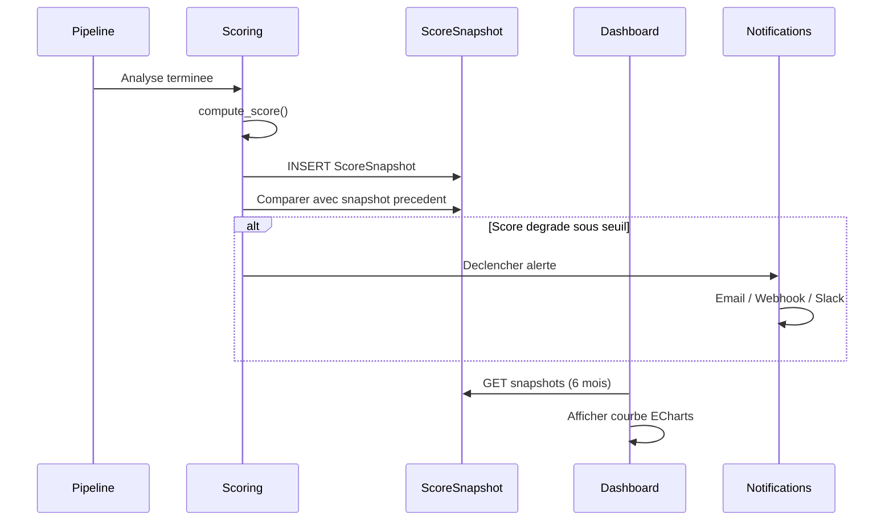
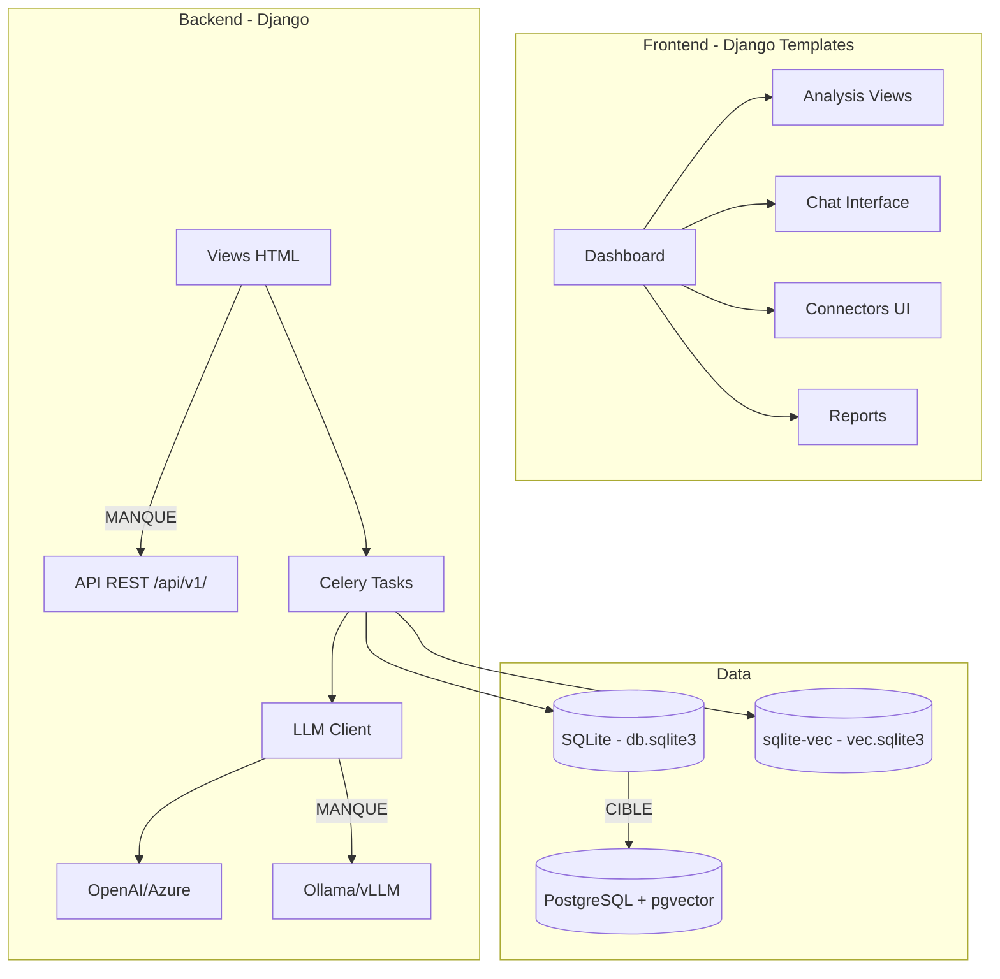

# Brainstorm : Axes d'amelioration de SCORE

**Date** : 2026-03-16
**Demande originale** : "Qu'est ce qu'on pourrait ameliorer dans cette application ?"
**Type** : Evolution
**Statut** : Qualifie
**Methode** : Verbalized Sample (5 reponses avec probabilite d'impact)

---

## Resume

Analyse exhaustive du codebase SCORE (250+ fichiers Python, templates Django, configuration, tests, Docker) croisee avec l'analyse concurrentielle de 25+ outils du marche. Identification de 5 axes d'amelioration majeurs classes par probabilite d'impact maximal sur l'adoption et la credibilite du projet.

---

## Contexte Fonctionnel

### Position dans le marche

SCORE occupe une niche **non contestee** : l'audit qualite d'un corpus documentaire en amont du RAG.

```
┌─────────────────────────────────────────────────────┐
│  1. QUALITE DU CORPUS (pre-ingestion)               │  <-- SCORE est ICI, seul
│     Doublons, contradictions, lacunes, clustering,   │
│     note globale A-E                                 │
├─────────────────────────────────────────────────────┤
│  2. TRAITEMENT / INGESTION                           │  <-- Unstructured, Docling, LlamaParse
│     Parsing, chunking, extraction, ETL               │
├─────────────────────────────────────────────────────┤
│  3. EVALUATION DU PIPELINE RAG (post-deploiement)   │  <-- Ragas, DeepEval, LangSmith, etc.
│     Faithfulness, relevance, hallucination runtime   │
└─────────────────────────────────────────────────────┘
```

Aucun outil ne combine detection de doublons semantiques + extraction de claims + detection de contradictions + analyse de lacunes + clustering + score qualite global.

### Modules concernes

| Module | Fichiers cles | Etat actuel |
|--------|---------------|-------------|
| LLM Client | `llm/client.py` | OpenAI, Azure, Mistral. Pas de modeles locaux natifs |
| Connectors | `connectors/` | 3 connecteurs (Confluence, SharePoint, HTTP) |
| Analysis Pipeline | `analysis/pipeline.py` | 12 phases, resilient mais pas de circuit breaker |
| Vectorstore | `vectorstore/store.py` | sqlite-vec, KNN brute-force |
| Dashboard | `dashboard/` | Django templates + D3.js + ECharts, pas de REST API |
| Chat/RAG | `chat/rag.py` | 8 techniques composables, pas de streaming |
| Multi-tenant | `tenants/` | Solide, mais pas de 2FA ni API keys |
| Tests | `tests/` | 428 tests, ~57% couverture, audit/* non teste |
| Docker | `Dockerfile` | Multi-stage mais pas de `migrate`, tourne en root |

---

## Analyse : Verbalized Sample (5 axes)

> Chaque reponse represente un axe d'amelioration independant, avec une probabilite estimee
> qu'il soit **le plus impactant** pour l'adoption et la credibilite du projet.

---

### Reponse 1 — API REST programmatique (probabilite : 35%)

#### Le probleme

SCORE n'a **aucune API REST**. Toutes les interactions passent par des templates Django server-rendered. Pas d'OpenAPI spec, pas de bearer token, pas d'acces programmatique.

#### Ou dans l'application ?

```
┌─────────────────────────────────────────────────────────┐
│  [Logo]  SCORE                            [User v]      │
├─────────────────────────────────────────────────────────┤
│ ┌──────────┐                                            │
│ │ Sidebar  │  ┌───────────────────────────────────────┐ │
│ │          │  │                                       │ │
│ │ > Projets│  │  TOUTE L'APPLICATION EST              │ │
│ │   Connec.│  │  SERVER-RENDERED                      │ │
│ │   Analyse│  │                                       │ │
│ │   Chat   │  │  Pas de /api/v1/... endpoints         │ │
│ │   Rapport│  │  Pas d'OpenAPI spec                   │ │
│ │          │  │  Pas de token auth                    │ │
│ └──────────┘  └───────────────────────────────────────┘ │
└─────────────────────────────────────────────────────────┘
```

#### Pourquoi c'est critique

- Impossible d'integrer SCORE dans un pipeline CI/CD (ex: bloquer un merge si le score < C)
- Impossible de construire un frontend SPA moderne dessus
- Impossible de l'utiliser comme brique dans un workflow LangChain/LlamaIndex/Haystack
- Les concurrents (Ragas, DeepEval, Evidently) sont **API-first** — c'est le standard attendu

#### Endpoints proposes



| Endpoint | Methode | Description |
|----------|---------|-------------|
| `/api/v1/projects/` | GET, POST | Liste/creation de projets |
| `/api/v1/projects/:id/score` | GET | Nutri-Score en JSON |
| `/api/v1/projects/:id/analyze` | POST | Lancer une analyse |
| `/api/v1/projects/:id/report` | GET | Rapport complet (JSON/PDF) |
| `/api/v1/connectors/` | CRUD | Gestion des connecteurs |
| `/api/v1/connectors/:id/sync` | POST | Declencher une synchronisation |
| `/api/v1/jobs/:id` | GET | Statut d'un job |
| `/api/v1/chat/` | POST | Question RAG |
| `/api/v1/auth/token` | POST | Obtenir un bearer token |

#### Impact

- Integrations CI/CD, Slack, Teams, webhooks
- Frontend SPA possible (React, Vue)
- Client libraries Python/JS/Go auto-generes via OpenAPI
- Adoption par les developpeurs (le public le plus exigeant)

#### Fichiers a modifier/creer

| Fichier | Action | Complexite |
|---------|--------|------------|
| `score/api/` (nouveau package) | Creer | Haute |
| `score/api/serializers.py` | Creer | Moyenne |
| `score/api/views.py` | Creer | Haute |
| `score/api/urls.py` | Creer | Faible |
| `score/api/authentication.py` | Creer (token auth) | Moyenne |
| `score/urls.py` | Modifier (ajouter /api/v1/) | Faible |
| `requirements.txt` | Ajouter djangorestframework, drf-spectacular | Faible |
| `tests/test_api_*.py` | Creer | Moyenne |

**Effort** : 2-3 semaines

---

### Reponse 2 — Support de modeles locaux / souverains (probabilite : 25%)

#### Le probleme

SCORE depend exclusivement d'APIs cloud (OpenAI, Azure OpenAI, Azure Mistral). Pas de support natif pour Ollama, vLLM, ou tout modele auto-heberge.

#### Etat actuel du client LLM

```python
# llm/client.py - Providers actuels
LLM_PROVIDER choices:
  - "openai"         -> OpenAI API (supporte base_url override)
  - "azure"          -> Azure OpenAI
  - "azure_mistral"  -> Azure Mistral (MaaS)

# Workaround non documente :
OPENAI_BASE_URL=http://localhost:11434/v1  # Ollama via compatibilite OpenAI
# Mais : pas teste, pas de health check, pas de gestion des limites de contexte
```

#### Pourquoi c'est critique

- **Souverainete** : CDC Informatique est un GIE du Groupe Caisse des Depots — acteur de la souverainete numerique francaise. Contradictoire de dependre d'OpenAI
- **Confidentialite** : les documents d'entreprise ne peuvent pas transiter par des APIs US (RGPD, donnees sensibles)
- **Cout** : les analyses LLM sur de gros corpus generent des couts importants (claims extraction, contradiction detection)
- **Disponibilite** : pas de dependance a un service externe en panne

#### Architecture proposee



| Provider | Mode | Avantage |
|----------|------|----------|
| `ollama` | Natif | Zero config, auto-detect modeles, health check |
| `vllm` | Natif | GPU on-premise, haute performance |
| `litellm` | Proxy | 100+ providers via une seule API |

#### Fichiers a modifier/creer

| Fichier | Action | Complexite |
|---------|--------|------------|
| `llm/client.py` | Ajouter providers ollama/vllm | Moyenne |
| `llm/providers/` (nouveau) | Creer classes provider | Moyenne |
| `llm/providers/ollama.py` | Creer (health check, model list) | Faible |
| `llm/providers/vllm.py` | Creer | Faible |
| `.env.example` | Documenter `OPENAI_BASE_URL`, `OLLAMA_HOST` | Faible |
| `config.yaml` | Ajouter section providers | Faible |
| `docs/deployment-sovereign.md` | Creer guide deploiement 100% local | Faible |
| `tests/test_llm_providers.py` | Creer | Moyenne |

**Effort** : 1-2 semaines

---

### Reponse 3 — Production-readiness (probabilite : 20%)

#### Les problemes

| Probleme | Fichier | Severite |
|----------|---------|----------|
| SQLite comme seule DB | `score/settings.py` | CRITIQUE |
| Dockerfile ne lance pas `migrate` | `Dockerfile:27` | CRITIQUE |
| Conteneur tourne en root | `Dockerfile` | HAUTE |
| Zero monitoring (pas de Sentry) | `score/settings.py` | CRITIQUE |
| Pas de rate limiting global | `score/ratelimit.py` | HAUTE |
| CSP autorise `unsafe-inline` | `score/middleware.py:14` | MOYENNE |
| Pas de metriques Prometheus | - | HAUTE |
| Pas de logging structure | `score/settings.py:300` | MOYENNE |
| docker-compose sans healthcheck | `docker-compose.yml` | HAUTE |
| docker-compose sans restart policy | `docker-compose.yml` | MOYENNE |

#### SQLite en multi-conteneur



#### Architecture cible



#### Checklist production

| Categorie | Etat actuel | Cible |
|-----------|:-----------:|:-----:|
| Database | SQLite | PostgreSQL + pgvector |
| Migrations Docker | Absentes | `manage.py migrate` dans entrypoint |
| Utilisateur conteneur | root | appuser (non-root) |
| Error tracking | Aucun | Sentry SDK |
| Metriques | Aucune | Prometheus + django-prometheus |
| Logging | Console basique | structlog JSON |
| Rate limiting | Par vue | Global + par IP |
| Healthcheck | `/healthz/` (web only) | Tous les services |
| Restart policy | Aucune | `restart: unless-stopped` |
| Resource limits | Aucun | CPU + memoire par service |
| Backup | Aucun | pg_dump cron + S3 |
| Secrets | `.env` fichier | Vault ou Docker secrets |

#### Fichiers a modifier/creer

| Fichier | Action | Complexite |
|---------|--------|------------|
| `score/settings.py` | Support PostgreSQL conditionnel | Moyenne |
| `Dockerfile` | migrate + non-root + entrypoint.sh | Faible |
| `docker-compose.yml` | PostgreSQL, healthchecks, limits | Moyenne |
| `docker-compose.override.yml` | Dev config (SQLite conserve) | Faible |
| `requirements.txt` | Ajouter psycopg2-binary, sentry-sdk, structlog, django-prometheus | Faible |
| `score/middleware.py` | Retirer unsafe-inline, ajouter nonces | Moyenne |
| `score/ratelimit.py` | Rate limit global middleware | Faible |
| `vectorstore/store.py` | Support pgvector alternatif | Haute |
| `docs/deployment.md` | Mettre a jour guide production | Faible |

**Effort** : 2-3 semaines

---

### Reponse 4 — Connecteurs supplementaires + architecture plugin (probabilite : 12%)

#### Etat actuel

```
connectors/
├── base.py          # BaseConnector ABC (bien concu)
├── generic.py       # HTTP + fichiers locaux
├── sharepoint.py    # SharePoint Online (OAuth/MSAL)
└── confluence.py    # Confluence (API REST)
```

3 connecteurs seulement. Pas de Google Drive, OneDrive, Notion, Jira, GitHub, Slack, Zendesk.

#### Couverture des sources documentaires enterprise

```
┌─────────────────────────────────────────────────────┐
│ Sources documentaires enterprise                     │
├─────────────────┬───────────────────────────────────┤
│ Supportees      │ Manquantes                         │
│                 │                                    │
│ SharePoint  [x] │ Google Drive            [ ]       │
│ Confluence  [x] │ OneDrive (perso)        [ ]       │
│ HTTP/Files  [x] │ Notion                  [ ]       │
│                 │ Jira (KB)               [ ]       │
│                 │ GitHub/GitLab wikis     [ ]       │
│                 │ Slack/Teams (threads)   [ ]       │
│                 │ Zendesk (help center)   [ ]       │
│                 │ Box / Alfresco          [ ]       │
│                 │ Email archives          [ ]       │
│                 │ Bases SQL               [ ]       │
│                 │ RSS feeds               [ ]       │
└─────────────────┴───────────────────────────────────┘
```

#### Architecture plugin proposee



#### Connecteurs prioritaires

| Connecteur | Segment cible | Effort | Priorite |
|-----------|---------------|--------|----------|
| Google Drive | Startups, ETI, education | 3-5 jours | P1 |
| Notion | Equipes tech, startups | 3-5 jours | P1 |
| GitHub/GitLab wikis | Equipes dev | 2-3 jours | P2 |
| OneDrive | Grands groupes Microsoft | 2-3 jours | P2 |
| Jira Knowledge Base | Equipes produit | 3-5 jours | P3 |
| Slack (threads epingles) | Communication enterprise | 5-7 jours | P3 |

#### Fichiers a modifier/creer

| Fichier | Action | Complexite |
|---------|--------|------------|
| `connectors/registry.py` | Creer (auto-discovery plugins) | Moyenne |
| `connectors/google_drive.py` | Creer | Moyenne |
| `connectors/notion.py` | Creer | Moyenne |
| `connectors/github.py` | Creer | Faible |
| `connectors/base.py` | Ajouter `list_changes()` pour sync incremental | Faible |
| `pyproject.toml` | Declarer extras_require par connecteur | Faible |
| `docs/connectors/` | Guide "ecrire un connecteur" | Faible |

**Effort** : 1 semaine par connecteur + 1 semaine architecture plugin

---

### Reponse 5 — Historique et tendances du score (probabilite : 8%)

#### Le probleme

SCORE calcule une note A-E a un instant T, mais ne conserve aucun historique. Impossible de voir si le corpus s'ameliore ou se degrade dans le temps.

#### Etat actuel du scoring

```python
# score/scoring.py - Calcul instantane, pas d'historisation
def compute_score(project) -> ScoreResult:
    # 7 dimensions -> penalites -> score 0-100 -> grade A-E
    # Resultat ephemere, pas persiste au-dela du job d'analyse
```

#### Wireframe de la solution proposee

```
┌─────────────────────────────────────────────────────────┐
│  Dashboard - Projet "Base documentaire RH"              │
├─────────────────────────────────────────────────────────┤
│                                                         │
│  Score actuel : [B] 68/100        (+5 depuis 30 jours) │
│                                                         │
│  Tendance (6 derniers mois)                             │
│  100 ┤                                                  │
│   80 ┤                    ╭──╮  ╭───                    │
│   60 ┤          ╭────╮╭──╯  ╰──╯                       │
│   40 ┤    ╭─────╯    ╰╯                                │
│   20 ┤────╯                                             │
│    0 ┤                                                  │
│      └──────────────────────────────────────────────    │
│      Oct   Nov   Dec   Jan   Fev   Mar                  │
│                                                         │
│  Alertes configurees :                                  │
│  [x] Notifier si score < C (40)                         │
│  [x] Notifier si > 10 nouvelles contradictions          │
│  [ ] Rapport hebdomadaire par email                     │
│                                                         │
│  ┌─ Comparaison derniere analyse ──────────────────┐    │
│  │ Doublons   : 12 -> 8   (-4)  [v amelioration]  │    │
│  │ Contradict.: 5  -> 3   (-2)  [v amelioration]  │    │
│  │ Lacunes    : 18 -> 22  (+4)  [^ degradation]   │    │
│  │ Clusters   : 6  -> 6   (=)   [- stable]        │    │
│  └─────────────────────────────────────────────────┘    │
└─────────────────────────────────────────────────────────┘
```

#### Modele de donnees



#### Workflow



#### Fichiers a modifier/creer

| Fichier | Action | Complexite |
|---------|--------|------------|
| `analysis/models.py` | Ajouter `ScoreSnapshot`, `ScoreAlert` | Faible |
| `score/scoring.py` | Persister le score apres calcul | Faible |
| `analysis/pipeline.py` | Creer snapshot en fin de pipeline | Faible |
| `dashboard/views.py` | Ajouter donnees de tendance au contexte | Faible |
| `dashboard/templates/dashboard/home.html` | Graphique ECharts tendance | Moyenne |
| `analysis/notifications.py` | Creer (alertes email/webhook) | Moyenne |
| `tests/test_score_history.py` | Creer | Faible |

**Effort** : 1 semaine

---

## Tableau recapitulatif

| # | Axe d'amelioration | Prob. impact | Effort | Benefice principal |
|:-:|---------------------|:------------:|:------:|---------------------|
| 1 | **API REST programmatique** | **35%** | 2-3 sem. | Integrations, ecosysteme, adoption developpeur |
| 2 | **Modeles locaux / souverains** | **25%** | 1-2 sem. | Souverainete, secteur public, couts LLM |
| 3 | **Production-readiness** | **20%** | 2-3 sem. | Deploiement reel, fiabilite, securite |
| 4 | **Connecteurs + plugins** | **12%** | 3-5 sem. | Couverture des sources, communaute |
| 5 | **Historique et tendances** | **8%** | 1 sem. | ROI mesurable, reporting direction |

Les probabilites sont additives (= 100%). Elles refletent l'estimation de quel axe, pris isolement, aurait le plus grand impact sur l'adoption et la credibilite de SCORE.

En pratique, les axes 1+2+3 sont complementaires et devraient etre traites en parallele.

---

## Exploration du Codebase

### Features Similaires Detectees

| Feature existante | Fichiers | Reutilisation possible |
|-------------------|----------|------------------------|
| BaseConnector ABC | `connectors/base.py` | Patron pour architecture plugin |
| LLMClient multi-provider | `llm/client.py` | Etendre pour ollama/vllm |
| Pipeline trace system | `analysis/trace.py` | Reutiliser pour metriques Prometheus |
| Scoring compute | `score/scoring.py` | Ajouter persistance ScoreSnapshot |
| Celery task orchestration | `analysis/tasks.py` | Base pour WebSocket progress |
| D3.js + ECharts | `dashboard/templates/` | Reutiliser pour courbes tendance |

### Contexte Architectural



### Analyse d'Impact Globale

| Aspect | Evaluation | Details |
|--------|------------|---------|
| Fichiers a creer | ~25 | API package, providers, connecteurs, migrations, tests |
| Fichiers a modifier | ~15 | settings, Dockerfile, docker-compose, client LLM, scoring |
| Migrations DB | 2-3 | ScoreSnapshot, ScoreAlert, PostgreSQL support |
| Risques | Moderees | Migration SQLite->PostgreSQL est la plus risquee |
| Complexite globale | **Haute** | 5 chantiers independants mais complementaires |

### Risques Identifies

| Risque | Severite | Mitigation |
|--------|----------|------------|
| Migration SQLite vers PostgreSQL casse les deploiements existants | Haute | Garder SQLite en dev, PostgreSQL en prod. Guide migration |
| API REST expose des vulnerabilites | Moyenne | Rate limiting, auth token, tests de securite |
| Modeles locaux moins performants que GPT-4o | Moyenne | Benchmarker claims extraction / contradiction detection |
| Trop de connecteurs a maintenir | Faible | Architecture plugin, contributions communautaires |
| Historique gonfle la base | Faible | Retention configurable, archivage automatique |

---

## Conclusion

SCORE est un outil **techniquement solide** avec un positionnement **unique** sur le marche. Les 5 axes identifies ne sont pas des corrections de bugs mais des **accelerateurs d'adoption** :

1. **API REST** (35%) — ouvre l'ecosysteme developpeur et les integrations
2. **Modeles souverains** (25%) — debloque le secteur public et les grands groupes
3. **Production-readiness** (20%) — permet un deploiement reel et fiable
4. **Connecteurs** (12%) — elargit la couverture des sources documentaires
5. **Historique** (8%) — rend la valeur mesurable dans le temps

**Prochaine etape recommandee** : lancer `/ai-plan-interview` sur l'axe 1 (API REST) ou l'axe 2 (modeles souverains) pour transformer cette analyse en plan d'implementation.

---
*Document genere le 2026-03-16 par `/ai-ask`*
