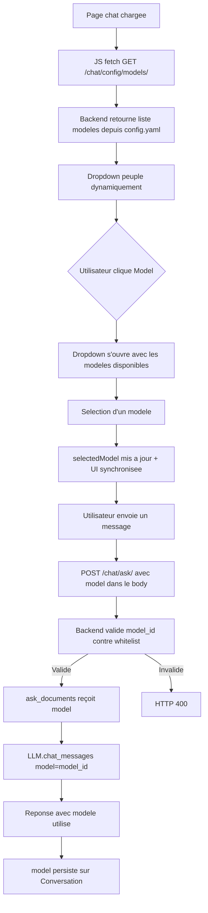
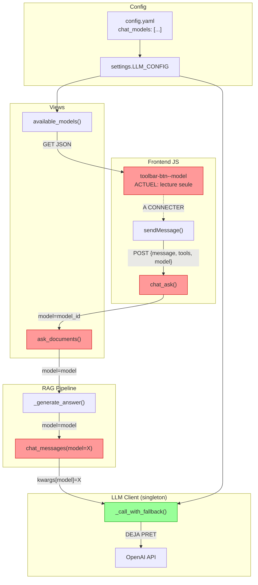

# Brainstorm : Support multi-modele LLM dans le chat

**Date** : 2026-03-17
**Demande originale** : "Ajouter le support multi-modele LLM dans l'application SCORE. L'utilisateur doit pouvoir choisir un modele LLM parmi une liste configuree dans config.yaml, et ce choix doit etre effectif pour la conversation chat."
**Type** : Evolution
**Statut** : Qualifie

---

## Resume

L'application SCORE utilise actuellement un seul modele LLM (`C2-Cloud-Gemini-2.5-Pro`) configure dans `config.yaml` pour toutes les conversations chat. L'utilisateur n'a aucun moyen de choisir un modele different. Le selecteur de modele dans l'UI du chat etait auparavant un vestige Mistral hardcode et vient d'etre nettoye pour afficher le modele reel en lecture seule. Cette evolution vise a rendre ce selecteur interactif et fonctionnel.

## Contexte Fonctionnel

### Modules concernes
- **Chat** : Module principal impacte (views, RAG pipeline, modeles, template)
- **LLM** : Couche d'abstraction LLM (client unique/singleton)
- **Config** : Configuration YAML + settings Django

### Ou dans l'application ?

```
+-----------------------------------------------------+
|  [Logo]  SCORE          [Projet ▼]    [User ▼]      |
+-----------------------------------------------------+
| +----------+ +------------------------------------+  |
| | Sidebar  | |  Assistant IA                      |  |
| |          | |                                    |  |
| | Convs    | |  [Messages...]                     |  |
| | - Conv 1 | |                                    |  |
| | - Conv 2 | |                                    |  |
| |          | +------------------------------------+  |
| |          | | +--------+ +------+ +----+  [Send] |  |
| |          | | |Outils ▼| |Model▼| |Sys |         |  |
| |          | | +--------+ +------+ +----+         |  |
| |          | |   [________Votre message________]  |  |
| +----------+ +------------------------------------+  |
+-----------------------------------------------------+
                     ^
                     |
              LE BOUTON [Model▼]
         doit devenir un selecteur
         interactif avec la liste des
         modeles depuis config.yaml
```

---

## Analyse de l'Evolution

### Evaluation

| Critere | Evaluation | Commentaire |
|---------|------------|-------------|
| Coherence projet | Forte | Suit le pattern existant (tools/outils) |
| Valeur ajoutee | Haute | Permet de tester differents modeles par conversation |
| Complexite | Moyenne | ~190 lignes, 10 fichiers, 1 migration |
| Risques | Faibles | Architecture deja preparee (`_call_with_fallback`) |

### Workflow propose



---

## Exploration du Codebase

### Features Similaires Detectees

| Feature | Fichiers | Similarite | Reutilisation |
|---------|----------|------------|---------------|
| **Selecteur d'outils RAG** | `chat/home.html` (JS: activeTools, syncToolsUI) | Haute | Pattern exact a cloner (multi-select → single-select) |
| **Sauvegarde system prompt** | `chat/views.py:save_system_prompt` | Moyenne | Pattern endpoint config JSON |
| **ChatConfig par projet** | `chat/models.py:ChatConfig` | Moyenne | Pattern per-user/per-project config |
| **Fallback models** | `llm/client.py:_call_with_fallback` | Haute | Supporte deja kwargs["model"] en override |

**Elements reutilisables cles** :
- `_call_with_fallback()` lit deja `kwargs.get("model", self._chat_model)` → le plumbing interne est pret
- CSS `.model-dropdown`, `.model-option`, `.model-category` → deja defini (lignes 839-893)
- Pattern `tools` dans `sendMessage()` → a cloner pour `model`
- `Conversation.tools` (JSONField) → meme pattern pour `Conversation.model` (CharField)

### Contexte Architectural



Rouge = a modifier. Vert = deja pret.

### Analyse d'Impact

| Aspect | Evaluation | Details |
|--------|------------|---------|
| Fichiers a modifier | 9 | config.yaml, settings.py, models.py, urls.py, views.py, rag.py, client.py, home.html, tests |
| Fichier a creer | 1 | Migration Django |
| Migration DB | Oui | `Conversation.model` CharField (non-destructif, default="") |
| Niveau de risque | Faible | Singleton LLM non mute, override par kwarg |
| Complexite globale | **Moyenne** | ~190 lignes |

---

## Decisions de Design

### 1. Model par Conversation (pas par Message)

Comme pour `tools`, le modele est stocke au niveau `Conversation`, pas `Message`. Cela simplifie l'UX (pas de changement mid-conversation) et suit le pattern existant.

### 2. Embedding model FIXE

L'embedding model (`bge-m3-custom-fr`) ne doit JAMAIS changer avec la selection utilisateur. Les vecteurs en base doivent rester dans le meme espace. Seul le modele de chat/completion est switchable.

### 3. Override par kwarg (pas mutation du singleton)

```python
# CORRECT : override local, thread-safe
def chat_messages(self, messages, ..., model: str | None = None):
    actual_model = model or self._chat_model
    kwargs = {"model": actual_model, ...}

# INCORRECT : mutation du singleton, race condition
llm._chat_model = user_model  # JAMAIS
```

### 4. Whitelist server-side obligatoire

Le backend DOIT valider `model_id` contre la liste `chat_models` de `config.yaml`. Jamais de pass-through direct vers l'API OpenAI.

### 5. Title generation : modele par defaut

La generation du titre de conversation (`llm.chat()` dans `chat_ask`) utilise toujours le modele par defaut (rapide/economique), independamment du choix utilisateur.

---

## Fichiers a Modifier

| Fichier | Modification | Effort |
|---------|-------------|--------|
| `config.yaml` | Ajouter section `chat_models` avec id/name/category | Trivial |
| `score/settings.py` | Exposer `chat_models` dans `LLM_CONFIG` | Trivial |
| `chat/models.py` | Ajouter `model = CharField` a `Conversation` | Trivial + migration |
| `chat/urls.py` | Ajouter route `config/models/` | Trivial |
| `chat/views.py` | (1) Endpoint `available_models`; (2) Lire/valider model dans `chat_ask`; (3) Passer aux templates | Faible |
| `chat/rag.py` | Ajouter param `model` a `ask_documents()`, `_generate_answer()`, `_retrieval_pipeline()` | Faible |
| `chat/rag_techniques.py` | Propager param `model` dans les ~10 fonctions techniques | Moyen |
| `llm/client.py` | Ajouter param `model` a `chat()` et `chat_messages()` | Faible |
| `chat/templates/chat/home.html` | Dropdown interactif, JS `selectedModel`, `model` dans fetch | Moyen |
| `tests/test_chat_views.py` | Tests endpoint models, validation, forwarding | Faible |

### Structure config.yaml proposee

```yaml
llm:
  chat_model: C2-Cloud-Gemini-2.5-Pro        # Defaut (inchange)
  chat_models:                                 # NOUVEAU
    - id: C2-Cloud-Gemini-2.5-Pro
      name: "Gemini 2.5 Pro"
      category: "raisonnement"
    - id: C2-Cloud-Gemini-2.5-Flash
      name: "Gemini 2.5 Flash"
      category: "rapide"
  fallback_models:                             # Inchange
    - C2-Cloud-Gemini-2.5-Flash
```

---

## Risques Identifies

| Risque | Severite | Mitigation |
|--------|----------|------------|
| Model ID invalide passe au backend | Moyenne | Whitelist server-side dans `chat_ask()` |
| Mutation du singleton LLMClient | Haute | Override par kwarg uniquement, jamais de mutation |
| Embedding model change accidentellement | Haute | `embed_single()` ignore le param model |
| Propagation model dans rag_techniques.py | Faible | ~10 call sites, pattern repetitif |
| Concurrence (multi-thread Django) | Faible | kwarg local, pas d'etat partage |

---

## Conclusion

Cette evolution est **bien preparee architecturalement** :
- `_call_with_fallback()` supporte deja les overrides de modele
- Le CSS du dropdown est deja defini
- Le pattern `tools` fournit un template exact a cloner

L'effort principal est le **plumbing** du parametre `model` a travers 4 couches (JS → views → rag → llm) et la propagation dans les ~10 fonctions de `rag_techniques.py`.

## Prochaine etape

Le document brainstorm a ete ecrit dans `docs/brainstorm/2026-03-17_evolution_multi-modele-llm-chat.md`.

→ Voulez-vous lancer `/ai-plan-interview` pour transformer cette analyse en plan d'implementation ?

---
*Document genere le 2026-03-17 par `/ai-ask`*
