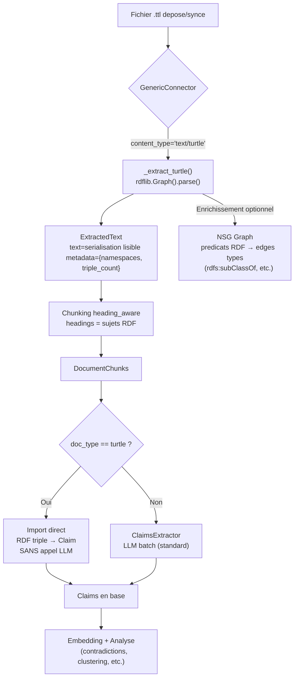
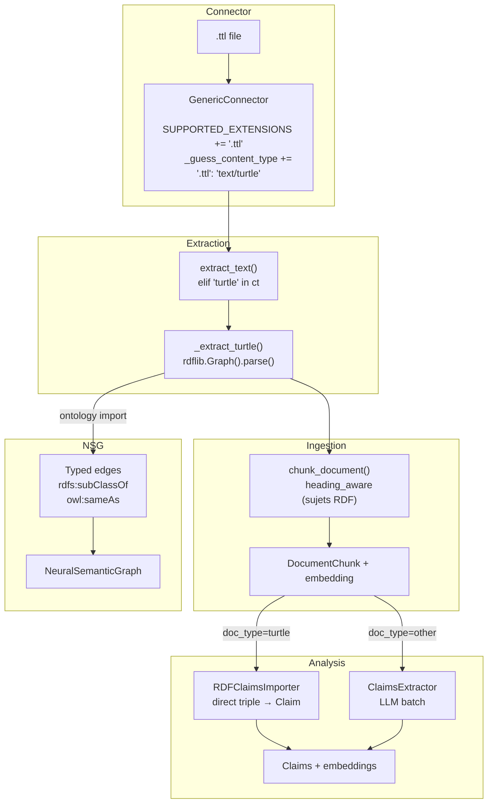

# Brainstorm : Support des documents RDF/Turtle (.ttl)

**Date** : 2026-03-19
**Demande originale** : "Je voudrais que SCORE gere ce format [RDF/Turtle]"
**Type** : Evolution
**Statut** : Qualifie

---

## Resume

L'utilisateur souhaite que SCORE puisse ingerer et analyser des documents au format RDF/Turtle (.ttl), un format du web semantique utilisant des triplets sujet-predicat-objet. Cette evolution s'aligne naturellement avec l'architecture existante de SCORE, dont le modele `Claim` stocke deja des triplets S-P-O, et offre une opportunite unique de bypass des appels LLM pour l'extraction de claims.

## Contexte Fonctionnel

### Modules concernes

- **F-ING (Ingestion)** : Ajout d'un nouveau format de document supporte
- **F-ANA-002 (Claims extraction)** : Import direct de triplets RDF comme claims (sans LLM)
- **F-ANA-008 (Graphe semantique)** : Enrichissement du NSG avec les relations typees RDF

### Qu'est-ce que le RDF/Turtle ?

Le format Turtle (Terse RDF Triple Language) est une syntaxe de serialisation RDF lisible par l'humain. Chaque statement est un triplet sujet-predicat-objet :

```turtle
@prefix ex:  <http://example.org/ontology#> .
@prefix foaf: <http://xmlns.com/foaf/0.1/> .

ex:RegleAcces a ex:Rule ;
  foaf:name "Acceder a la Vitrine de l'offre" ;
  ex:actor ex:Lecteur .
```

### Ou dans l'application ?

```
┌─────────────────────────────────────────────────────────┐
│  [Logo]  SCORE Platform              [User ▼]           │
├─────────────────────────────────────────────────────────┤
│ ┌──────────┐  ┌──────────────────────────────────────┐  │
│ │ Sidebar  │  │  Connectors > Generic Connector      │  │
│ │          │  │                                      │  │
│ │ > Sources│  │  Source: /data/ontologies/            │  │
│ │   Analyze│  │  Extensions: .pdf .docx .ttl ← NEW   │  │
│ │   Chat   │  │                                      │  │
│ │   Reports│  │  [Sync Now]  [Schedule]               │  │
│ └──────────┘  └──────────────────────────────────────┘  │
│                                                         │
│               ┌──────────────────────────────────────┐  │
│               │  Documents ingeres                   │  │
│               │  ┌──────┬────────┬────────────────┐  │  │
│               │  │ Nom  │ Type   │ Claims         │  │  │
│               │  ├──────┼────────┼────────────────┤  │  │
│               │  │ doc1 │ PDF    │ 45 (via LLM)   │  │  │
│               │  │ onto │ Turtle │ 128 (direct!) ←│  │  │
│               │  └──────┴────────┴────────────────┘  │  │
│               └──────────────────────────────────────┘  │
└─────────────────────────────────────────────────────────┘
```

---

## Analyse de l'Evolution

### Evaluation

| Critere | Evaluation | Commentaire |
|---------|------------|-------------|
| Coherence PRD | S'aligne avec F-ING-002 (extraction multi-format) et F-ANA-002 (claims S-P-O) | |
| Valeur ajoutee | **Haute** | Import direct de triplets structures = 0 appel LLM pour claims |
| Complexite | **Moyenne** | Iteration 1 (extraction seule) = faible ; import direct claims = moyen |
| Risques | Faibles | rdflib est une lib mature, pas d'impact sur l'existant |
| Maintenabilite | Faible dette | Suit les patterns existants (extracteur + routing content_type) |

### Opportunite cle : economie d'appels LLM

Actuellement, chaque chunk de document passe par un appel LLM (`ClaimsExtractor`) pour extraire des triplets S-P-O. Pour les documents RDF, **tous les triplets sont deja explicites** :

| Approche | Appels LLM | Precision | Cout |
|----------|-----------|-----------|------|
| Standard (PDF/DOCX) | ~1 par chunk | ~80% (LLM) | $$$ |
| **RDF direct import** | **0** | **100%** | **$0** |

### Workflow propose



---

## Exploration du Codebase

### Features Similaires Detectees

| Feature | Fichiers | Similarite | Reutilisation |
|---------|----------|------------|---------------|
| Extraction PDF | `ingestion/extraction.py:103` | Haute | Meme pattern : import lazy + parse + ExtractedText |
| Claims S-P-O | `analysis/claims.py`, `analysis/models.py:138` | **Tres haute** | Le modele Claim EST un triplet S-P-O |
| Graphe semantique | `nsg/graph.py`, `nsg/concepts.py` | Haute | `_add_or_update_edge()` accepte deja des `relation_type` arbitraires |
| Chunking heading-aware | `ingestion/chunking.py:75` | Moyenne | Les sujets RDF peuvent servir de "headings" |

**Elements reutilisables** :
- `ExtractedText` dataclass → utiliser `metadata` pour stocker namespaces et triple_count
- `Claim(subject, predicate, object_value, qualifiers)` → mapping 1:1 avec les triplets RDF
- `Claim.qualifiers` JSONField → stocker les URIs originaux (`{"uri_subject": "http://...", "uri_predicate": "http://..."}`)
- `_add_or_update_edge(relation_type=...)` → utiliser les predicats RDF comme types de relation

### Contexte Architectural



**Couches impactees** :

| Couche | Composants | Impact |
|--------|------------|--------|
| Connector | GenericConnector (2 dicts) | **Trivial** |
| Extraction | extract_text + nouveau _extract_turtle | **Faible** |
| Chunking | heading_aware (reutilise tel quel) | **Aucun** |
| Claims | Import direct optionnel (RDFClaimsImporter) | **Moyen** |
| NSG Graph | Enrichissement edges types (optionnel) | **Moyen** |
| Database | Aucune migration | **Aucun** |

### Analyse d'Impact

| Aspect | Evaluation | Details |
|--------|------------|---------|
| Fichiers a creer | 2 | `ingestion/rdf_extractor.py`, `tests/test_rdf_extractor.py` |
| Fichiers a modifier | 3 | `connectors/generic.py`, `ingestion/extraction.py`, `requirements.txt` |
| Migration DB | **Non** | Modele Claim deja compatible (S-P-O + qualifiers) |
| Dependance | `rdflib>=6.0` | Pure Python, aucun conflit, lib mature |
| Niveau de risque | **Faible** | Pas d'impact sur fonctions existantes |
| Complexite globale | **Moyenne** | Iter. 1: Faible (extraction) / Iter. 2: Moyen (claims directes) |

**Risques identifies** :

| Risque | Severite | Mitigation |
|--------|----------|------------|
| Gros fichiers RDF (10k+ triplets) | Moyenne | Cap sur le nombre de triplets, chunking par sujet |
| Blank nodes (`_:b0`) opaques | Faible | Substituer par des labels positionnels lors de la serialisation |
| URIs verbeux gonflant les tokens | Moyenne | Serialiser avec prefixes via `graph.namespace_manager` |
| Turtle malformed | Faible | Capturer `rdflib.exceptions.ParserError` dans l'except |
| Meta-triplets schema (rdfs/owl) bruit | Faible | Filtrer les triplets schema lors de l'import claims |

---

## Plan d'implementation propose

### Iteration 1 : Extraction de base (priorite haute)

| Fichier | Modification | Effort |
|---------|-------------|--------|
| `requirements.txt` | Ajouter `rdflib>=6.0` | 2 min |
| `connectors/generic.py` | `SUPPORTED_EXTENSIONS` += `.ttl` + `_guess_content_type` += `.ttl: text/turtle` | 5 min |
| `ingestion/extraction.py` | Ajouter branche `elif "turtle" in ct` + `_extract_turtle()` | 2h |
| `tests/test_rdf_extractor.py` | Tests unitaires extraction Turtle | 1h |

**Resultat** : Les fichiers `.ttl` sont ingestibles, chunkes, embeddes, et analysables par le pipeline standard (claims via LLM).

### Iteration 2 : Import direct de claims (priorite moyenne)

| Fichier | Modification | Effort |
|---------|-------------|--------|
| `analysis/claims.py` | Conditionnel `if doc_type == "text/turtle"` → import direct | 4h |
| `tests/test_claims.py` | Tests import RDF → Claims | 2h |

**Resultat** : Les triplets RDF sont importes directement comme Claims sans appel LLM (economie significative).

### Iteration 3 : Enrichissement graphe semantique (priorite basse)

| Fichier | Modification | Effort |
|---------|-------------|--------|
| `analysis/semantic_graph.py` | Import RDF predicats comme edges types dans NSG | 3h |
| `nsg/graph.py` | (aucun changement structurel necessaire) | 0 |

**Resultat** : Le graphe semantique beneficie des relations typees RDF (rdfs:subClassOf, owl:sameAs, etc.).

---

## Questions et Clarifications

| Question | Contexte |
|----------|---------|
| Quels types de fichiers RDF cibler en priorite ? | `.ttl` (Turtle) semble le plus courant, mais `.rdf` (XML), `.n3`, `.nt`, `.jsonld` existent aussi |
| Les RDF seront-ils gros (>10k triplets) ? | Dimensionne le chunking et les garde-fous |
| Faut-il un import direct des claims (iter. 2) des le depart ? | Ou l'extraction LLM standard suffit-elle initialement ? |
| Les ontologies RDF doivent-elles enrichir le graphe (iter. 3) ? | Ou le graphe par co-occurrence suffit-il ? |

---

## Conclusion

Cette evolution est **hautement compatible** avec l'architecture SCORE :
- Le modele `Claim` EST un triplet S-P-O → mapping 1:1 avec RDF
- Le pattern d'extraction est trivial a etendre (cf. PDF, DOCX, etc.)
- L'iteration 1 est realisable en **~3h** avec zero migration DB
- L'iteration 2 (import direct) apporte une **economie significative d'appels LLM**

**Recommandation** : Implementer l'iteration 1 immediatement, puis l'iteration 2 si le volume de fichiers RDF le justifie.

---
*Document genere le 2026-03-19 par `/ai-ask`*
