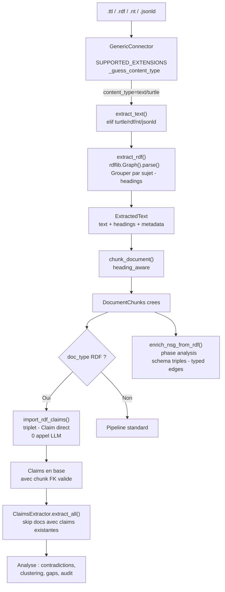

# PLAN : Support RDF multi-format (.ttl, .rdf, .nt, .jsonld)

> Genere par `/ai-plan-interview` le 2026-03-19

## 1. Contexte et objectif

SCORE est une plateforme d'analyse documentaire qui extrait des claims (triplets S-P-O) depuis des documents via LLM. Le format RDF/Turtle contient deja des triplets S-P-O explicites, ce qui permet un import direct sans appel LLM (100% precision, cout zero).

L'objectif est d'ajouter le support de 4 formats RDF (.ttl, .rdf, .nt, .jsonld) dans le pipeline d'ingestion, avec import direct des triplets comme Claims et enrichissement du graphe semantique NSG avec les relations typees.

**Brainstorm** : `docs/brainstorm/2026-03-19_evolution_support-rdf-turtle.md`

## 2. Approche architecturale

**Approche choisie** : Pragmatique + split 2 modules (optimisee pour PR upstream)

**Justification** : Diff minimal (2 fichiers crees, 5 modifies), zero migration DB, exploite le skip-logic existant de `ClaimsExtractor.extract_all()` (documents ayant deja des claims sont ignores par le LLM). Import des claims pendant l'ingestion pour resoudre la contrainte `Claim.chunk` FK non-nullable.

### Workflow RDF dans le pipeline



**Alternatives rejetees** :
- Minimale (3 fichiers, conditionnel dans ClaimsExtractor) — couple le ClaimsExtractor au format RDF
- Clean Architecture (8 fichiers, nouveau ConnectorType, migration DB) — sur-ingenierie pour ~250 lignes de logique

**Decision cle (pivot gap-analyst)** : L'import des claims RDF se fait pendant l'ingestion (`_process_document`), pas en phase analysis, car :
1. `Claim.chunk` FK est non-nullable → les chunks doivent exister
2. `ExtractedText.metadata` est transient → pas d'acces aux triplets en phase analysis

## 3. Criteres d'acceptation

- [ ] Les fichiers .ttl, .rdf, .nt et .jsonld sont detectes et ingeres par le GenericConnector
- [ ] Le texte extrait est structure par sujet RDF (headings) et chunke correctement
- [ ] Les triplets RDF sont importes directement comme Claims (0 appel LLM)
- [ ] Chaque Claim reference un DocumentChunk valide (FK non-nullable respecte)
- [ ] Les URIs sont raccourcis via namespace_manager (pas de truncation silencieuse)
- [ ] Les qualifiers de chaque Claim stockent les URIs originaux en JSON
- [ ] Le ClaimsExtractor LLM skip les documents RDF (fallback automatique si import echoue)
- [ ] Les predicats RDF enrichissent le graphe NSG avec des relation_type typees
- [ ] Les fichiers malformes sont geres gracieusement (erreur loggee, pipeline continue)
- [ ] rdflib absent = degradation gracieuse (ImportError catch, document skip)
- [ ] Les gros fichiers (5000+ triplets) sont traites avec cap configurable
- [ ] Les tests couvrent les 4 formats, blank nodes, URIs longs, fichiers malformes, sparse RDF

## 4. Analyse technique

### Fichiers a creer

| Fichier | Description |
|---------|-------------|
| `ingestion/rdf_extractor.py` | Module RDF : parsing 4 formats via rdflib, serialisation texte par sujet, generation headings, helper `extract_rdf()` retournant `ExtractedText` |
| `analysis/rdf_claims.py` | Module Claims RDF : `import_rdf_claims(document, chunks, raw_content, content_type)` pour import direct triplet→Claim, `enrich_nsg_from_rdf(nsg, raw_content, content_type, doc_id)` pour edges typees NSG |
| `tests/test_rdf_support.py` | Tests unitaires : 4 formats, claims import, NSG enrichment, edge cases |

### Fichiers a modifier

| Fichier | Modification |
|---------|--------------|
| `requirements.txt` | Ajouter `rdflib>=7.0` |
| `connectors/generic.py` | `SUPPORTED_EXTENSIONS` += `.ttl`, `.rdf`, `.nt`, `.jsonld` + `_guess_content_type` += 4 MIME types |
| `ingestion/extraction.py` | Ajouter branche `elif` pour 4 content-types RDF dans `extract_text()`, ajouter `ImportError` au except |
| `ingestion/pipeline.py` | Dans `_process_document()`, apres creation des chunks : si doc_type RDF, appeler `import_rdf_claims()` |
| `analysis/semantic_graph.py` | Dans `ProjectGraphBuilder.run()`, ajouter step RDF enrichment pour les docs RDF |

### Migration DB

**Non.** Le modele `Claim` a deja `subject`, `predicate`, `object_value`, `qualifiers` (JSONField). Mapping 1:1 avec les triplets RDF.

## 5. Plan d'implementation

### Phase 1 : Dependance et detection des formats RDF

- [ ] Ajouter `rdflib>=7.0` dans `requirements.txt`
- [ ] Ajouter `.ttl`, `.rdf`, `.nt`, `.jsonld` dans `SUPPORTED_EXTENSIONS` de `connectors/generic.py`
- [ ] Ajouter les 4 mappings MIME dans `_guess_content_type()` de `connectors/generic.py` :
  - `.ttl` → `text/turtle`
  - `.rdf` → `application/rdf+xml`
  - `.nt` → `application/n-triples`
  - `.jsonld` → `application/ld+json`
- [ ] Verifier avec `pip install rdflib` que pas de conflit de dependances

### Phase 2 : Module d'extraction RDF (`ingestion/rdf_extractor.py`)

- [ ] Creer `ingestion/rdf_extractor.py` avec :
  - Constante `RDF_CONTENT_TYPES` : dict mappant content_type → format rdflib (`{"text/turtle": "turtle", "application/rdf+xml": "xml", "application/n-triples": "nt", "application/ld+json": "json-ld"}`)
  - Constante `MAX_TRIPLES` : cap configurable (defaut 10000)
  - Fonction `extract_rdf(content: bytes | str, content_type: str) -> ExtractedText` :
    - Import lazy de `rdflib.Graph`
    - Parse via `Graph().parse(data=content, format=format_map[ct])`
    - Grouper les triplets par sujet URI
    - Pour chaque sujet : generer un heading (niveau 2) avec le label du sujet (rdfs:label > skos:prefLabel > URI local name > URI complet prefixe)
    - Serialiser les triplets du sujet en texte lisible : `predicat : objet` (un par ligne, prefixes via namespace_manager)
    - Retourner `ExtractedText(text=..., headings=[...], word_count=..., metadata={"format": "turtle", "triple_count": N, "namespaces": {...}, "subjects": [...]})`
  - Fonction helper `_shorten_uri(uri: str, nsm: NamespaceManager) -> str` : prefixer les URIs
  - Fonction helper `_get_label(graph, node) -> str` : rdfs:label > skos:prefLabel > local name
  - Fonction helper `_serialize_object(obj) -> str` : Literal avec lang/datatype, URIRef, BNode
- [ ] Ajouter branche `elif` dans `extract_text()` de `ingestion/extraction.py` pour router les 4 content-types RDF vers `extract_rdf()`
- [ ] Ajouter `ImportError` a la clause except de `extract_text()` (ligne 62)
- [ ] Gerer `rdflib.exceptions.ParserError` dans `extract_rdf()` → retourner `ExtractedText(text="", metadata={"extraction_error": str(e)})`

### Phase 3 : Import direct des Claims RDF (`analysis/rdf_claims.py`)

- [ ] Creer `analysis/rdf_claims.py` avec :
  - Constante `RDF_DOC_TYPES` : set des content-types RDF
  - Constante `SCHEMA_PREDICATES` : set des predicats schema a filtrer pour le graphe NSG (rdf:type, rdfs:subClassOf, owl:sameAs, rdfs:domain, rdfs:range, etc.)
  - Fonction `import_rdf_claims(document: Document, chunks: list[DocumentChunk], raw_content: bytes | str, content_type: str) -> int` :
    - Import lazy de `rdflib.Graph`
    - Re-parser le contenu RDF brut
    - Pour chaque triplet (s, p, o) non-schema :
      - Trouver le chunk correspondant (matcher le sujet du triplet avec le heading_path du chunk)
      - Creer un `Claim(document=document, chunk=chunk, project=document.project, tenant=document.tenant, subject=shorten(s)[:500], predicate=shorten(p)[:500], object_value=serialize(o)[:1000], qualifiers={"source": "rdf", "uri_s": str(s), "uri_p": str(p), "uri_o": str(o) if URIRef else None}, raw_text=f"{s} {p} {o} .")`
    - `Claim.objects.bulk_create(claims)` dans une transaction atomique
    - Retourner le nombre de claims creees
  - Fonction `enrich_nsg_from_rdf(nsg: NeuralSemanticGraph, raw_content: bytes | str, content_type: str, doc_id: str) -> int` :
    - Parser le contenu RDF
    - Pour chaque triplet schema (rdfs:subClassOf, owl:sameAs, skos:broader, etc.) :
      - Ajouter/mettre a jour un edge dans le NSG avec `relation_type` = predicat prefixe
    - Retourner le nombre d'edges ajoutes
- [ ] Modifier `ingestion/pipeline.py` `_process_document()` : apres la creation des chunks (ligne ~215), ajouter un bloc conditionnel :
  ```python
  if doc.doc_type in RDF_DOC_TYPES:
      from analysis.rdf_claims import import_rdf_claims
      import_rdf_claims(doc, new_chunks, raw_doc.content, raw_doc.content_type)
  ```
- [ ] Modifier `analysis/semantic_graph.py` `ProjectGraphBuilder.run()` : apres le feeding des claims (step 2), ajouter :
  ```python
  # Step 2.5: RDF ontology enrichment
  rdf_docs = docs.filter(doc_type__in=RDF_DOC_TYPES)
  for doc in rdf_docs:
      # Re-fetch raw content via connector
      enrich_nsg_from_rdf(nsg, raw_content, doc.doc_type, str(doc.id))
  ```

### Phase 4 : Gestion des edge cases

- [ ] Sparse RDF (< 50 tokens) : dans `extract_rdf()`, si le texte serialise est < 50 tokens, ajouter un padding "Document RDF contenant N triplets." pour garantir au moins 1 chunk
- [ ] Blank nodes : dans `_serialize_object()`, remplacer `_:bN` par `[blank-N]` avec un compteur
- [ ] URIs longs : `_shorten_uri()` utilise namespace_manager en priorite, puis tronque seulement en dernier recours
- [ ] Cap sur les triplets : si `len(graph) > MAX_TRIPLES`, tronquer avec warning dans metadata et log
- [ ] Transactions atomiques : `import_rdf_claims` utilise `transaction.atomic()` par document pour garantir la coherence en cas de crash

### Phase 5 : Tests

- [ ] Creer `tests/test_rdf_support.py` avec :
  - `TestExtractRDF` :
    - `test_extract_turtle` : parse inline Turtle, verifie text + headings + metadata
    - `test_extract_rdfxml` : parse inline RDF/XML
    - `test_extract_ntriples` : parse inline N-Triples
    - `test_extract_jsonld` : parse inline JSON-LD
    - `test_extract_malformed` : verifie retour ExtractedText vide + extraction_error
    - `test_extract_rdflib_missing` : mock ImportError, verifie degradation gracieuse
    - `test_extract_blank_nodes` : verifie serialisation blank nodes
    - `test_extract_long_uris` : verifie prefixage des URIs
    - `test_extract_sparse` : verifie padding pour < 50 tokens
    - `test_extract_large` : verifie cap sur MAX_TRIPLES
  - `TestImportRDFClaims` :
    - `test_import_basic_triples` : import direct, verifie Claim fields
    - `test_import_chunk_mapping` : verifie que chaque Claim pointe vers le bon chunk
    - `test_import_qualifiers` : verifie URIs dans qualifiers JSON
    - `test_import_schema_filtered` : verifie que rdfs:subClassOf etc. ne creent pas de claims
    - `test_import_atomic_transaction` : verifie rollback sur erreur
    - `test_llm_fallback_skip` : verifie que ClaimsExtractor skip les docs avec claims RDF
  - `TestEnrichNSG` :
    - `test_enrich_typed_edges` : verifie que rdfs:subClassOf → edge avec relation_type
    - `test_enrich_no_duplicate_nodes` : verifie merge avec concepts existants
- [ ] Executer `pytest tests/test_rdf_support.py -v` et verifier 100% pass
- [ ] Executer `pytest tests/ -v` pour verifier non-regression

## 6. Analyse des Gaps (Gap-Analyst)

> Section generee par l'agent gap-analyst (exploration du codebase reel)

### Edge Cases a gerer

| ID | Categorie | Description | Source | Strategie | Priorite |
|----|-----------|-------------|--------|-----------|----------|
| EC-1 | db_constraint | `Claim.chunk` FK non nullable | `analysis/models.py:145` | Import claims pendant ingestion (chunks disponibles) | CRITIQUE |
| EC-2 | field_length | `Claim.subject` max_length=500, URIs potentiellement longs | `analysis/models.py:150` | Prefixer via namespace_manager avant truncation | MOYENNE |
| EC-3 | transience | `ExtractedText.metadata` non persiste en DB | `ingestion/pipeline.py:128-233` | Import claims pendant ingestion (contenu brut disponible) | HAUTE |
| EC-4 | chunking | Sparse RDF < 50 tokens → zero chunks | `ingestion/chunking.py:96` | Padding texte pour garantir >= 1 chunk | MOYENNE |
| EC-5 | error_handling | `extract_text()` except manque ImportError + ParserError | `ingestion/extraction.py:62` | Ajouter au except clause | HAUTE |
| EC-6 | volume | 10000+ triples → batch embedding limits | `analysis/claims.py:150` | Cap configurable + batch par 500 | MOYENNE |

### Failure Modes couverts

| Composant | Failure | Handling actuel | Handling prevu |
|-----------|---------|-----------------|----------------|
| rdflib | ImportError | Non gere (crash module) | Lazy import + catch ImportError → skip document |
| rdflib | ParserError (malformed) | Propage a pipeline.py except | Catch explicite → ExtractedText vide + log |
| Pipeline resume | Crash pendant import claims | Claims idempotent (skip docs with claims) | bulk_create atomique par document |
| Embedding API | Rate limit sur 10000 claims | Batch existant (500/batch) | Reutiliser le meme batch pattern |

### Patterns reutilises du codebase

| Pattern | Source | Application |
|---------|--------|-------------|
| Lazy import | `extraction.py:105,136,168` | `from rdflib import Graph` dans la fonction |
| ExtractedText return | `extraction.py:23-30` | Meme dataclass avec metadata enrichi |
| elif routing | `extraction.py:42-56` | Nouveau elif pour 4 content-types RDF |
| bulk_create | `claims.py:132` | Import atomique des claims RDF |
| doc_ids_with_claims filter | `claims.py:46-51` | LLM skip automatique pour docs RDF |
| _add_or_update_edge | `nsg/graph.py:236` | Predicats RDF comme relation_type |

### Confiance de l'analyse

**Score** : 85% | **Fichiers explores** : extraction.py, claims.py, pipeline.py, models.py, chunking.py, semantic_graph.py, graph.py, tasks.py, generic.py

## 7. Analyse Code Field

### Hypotheses techniques

| Hypothese | Source |
|-----------|--------|
| `Claim.chunk` FK non nullable en production | gap-analyst `models.py:145` + `0001_initial.py` |
| `ClaimsExtractor` filter par document_id (pas chunk) | gap-analyst `claims.py:46-51` |
| Les 4 formats RDF sont supportes par rdflib.Graph.parse(format=X) | inference (doc rdflib) |
| Le GenericConnector lit les .ttl comme des fichiers binaires | inference (fetch_document pattern) |
| Les URIs RDF standards tiennent dans 500 chars apres prefixage | inference |

### Limitations connues

- [ ] Pas de support SPARQL (pas de requetes sur le graphe RDF)
- [ ] Pas de gestion des named graphs / quad stores (N-Quads, TriG)
- [ ] rdflib charge le graphe entier en memoire (limite ~100k triplets)
- [ ] NSG enrichment necessite un re-fetch du contenu brut via le connecteur
- [ ] Les blank nodes perdent leur identite inter-documents (pas de resolution globale)

### Conditions de validite

- [ ] `rdflib>=7.0` s'installe sans conflit avec les dependances existantes
- [ ] Les fichiers RDF sont accessibles via GenericConnector (filesystem ou HTTP)
- [ ] Le contenu brut RDF est disponible dans `raw_doc.content` lors de `_process_document()`

## 8. Tests prevus

### Tests Backend

- [ ] Extraction des 4 formats RDF (inline strings, pas de fichiers externes)
- [ ] Import direct triplets → Claims avec FK chunk valide
- [ ] Enrichissement NSG avec edges types
- [ ] Gestion fichiers malformes (ParserError)
- [ ] Degradation gracieuse si rdflib absent (ImportError)
- [ ] Gestion blank nodes, URIs longs, sparse RDF, large RDF
- [ ] Transaction atomique des claims (rollback sur erreur)
- [ ] LLM fallback : ClaimsExtractor skip les docs avec claims RDF existantes
- [ ] Non-regression du pipeline existant (PDF, DOCX, etc.)

### Tests Frontend

- [ ] Aucun changement UI dans cette iteration

### data-testid prevus

Aucun (pas de changement UI).

## 9. Documentation a mettre a jour

- [ ] `docs/PRD-functional.md` : Ajouter RDF/Turtle a F-ING-002 (formats supportes)
- [ ] `docs/PRD-technical.md` : Ajouter rdflib a la stack, documenter le flow RDF

### backend/NOTES_DE_VERSION.md

Ajouter l'entree suivante :

```markdown
### ✨ **Nouveautes**

#### 📄 **Support des documents RDF/Turtle**
SCORE peut maintenant ingerer et analyser des documents au format RDF (Web Semantique).
Les triplets sujet-predicat-objet contenus dans ces fichiers sont importes directement
comme claims structurees, sans appel LLM — plus rapide et plus precis.

- Formats supportes : Turtle (.ttl), RDF/XML (.rdf), N-Triples (.nt), JSON-LD (.jsonld)
- Import direct des triplets comme claims (0 appel LLM)
- Enrichissement du graphe semantique avec les relations typees (rdfs:subClassOf, owl:sameAs, etc.)
```

## 10. Estimation d'effort

| Composant | Estimation | Notes |
|-----------|------------|-------|
| Phase 1 (dependance + detection) | 0.5h | Modifications triviales |
| Phase 2 (rdf_extractor.py + routing) | 3h | Module principal ~120 lignes |
| Phase 3 (rdf_claims.py + integration) | 4h | Claims + NSG + hooks pipeline |
| Phase 4 (edge cases) | 2h | Blank nodes, sparse, cap, transactions |
| Phase 5 (tests) | 3h | ~20 tests unitaires |
| **Total** | **12.5h** | |

---

> **Prochaine etape** : `/ai-plan-check docs/planning/PLAN_RDF_TURTLE_SUPPORT.md`
